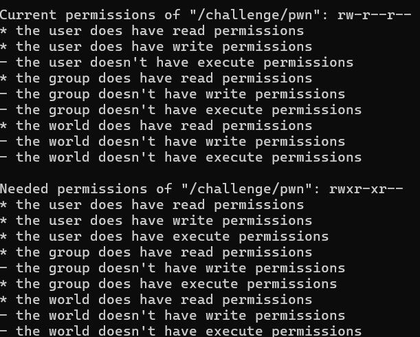
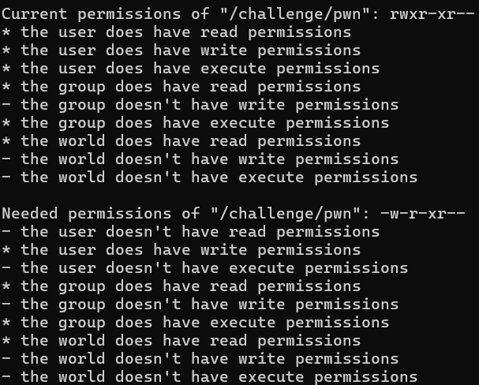
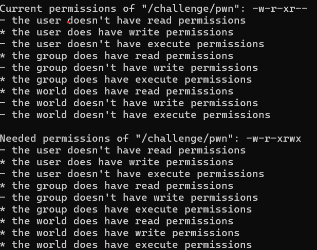
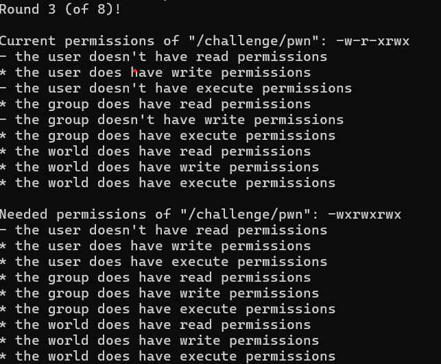
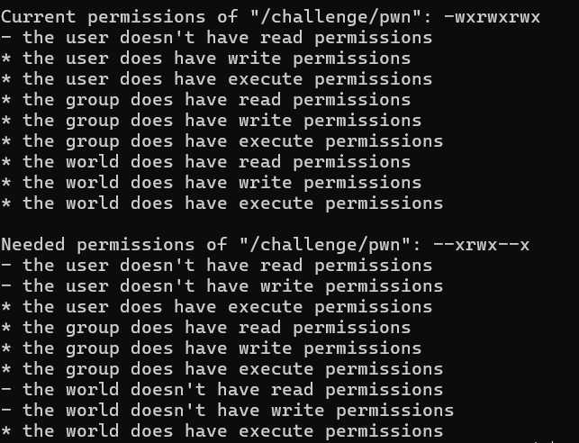
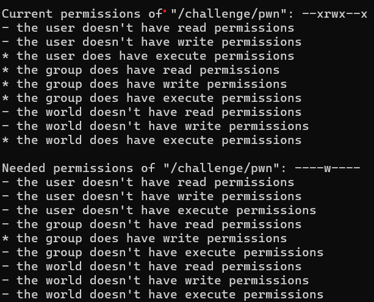

# Perceiving Permisions
In Linux, files have different permissions or file modes. You can check out a permissions of a file or directory using `ls -l`.

The File Type
    The first character of each line represents the file type. In pwn_directory's case, the d indicates that it's a directory,the - represents that it's a normal file. There are other types as well which we will learn later.

The Permissions
    The next nine characters are the actual access permissions of the file or directory, split into
     3 characters denoting the permissions that the user who owns the file (termed the "owner") has to the file
     3 characters denoting the permissions that the group that owns the file (termed the "group") has to the file
     3 characters denoting the permissions that all other access
   

## Challenge-1 Changing File Ownership
This challenge is about teaching how to change the ownership of the file to allow another user than `root` to own a file using `chown` command

In this challenge, `/file` must be accessed to get the flag but it is currently owned by `root` which makes cat /flag show permission denied.

The owner of the flag file can be changed by `chown hacker /flag` and now `cat /flag` gives

flag `pwn.college{MRjg-Tfq8AgArbsCQjWCz_so37_.dFTM2QDL0MTO0czW}`
  

## Challenge-2 Groups and Files
In Linux a file access can be owned by a group of users. But you also have the capability to change what group may own the said file. For that you can use `chgrp` command

This challenge is similar to the previous challenge but the group of the file must be changed instead. This can be done by `chgrp hacker /flag` and invoking `cat /flag` gives

flag `pwn.college{khMEDNxLRmI-HM0YlJVgJTWtEkv.dFzNyUDL0MTO0czW}`
  

## Challenge-3 Fun with Groups Names
You can also check  the name of the group you are in and every other using the id command

The challenge is like the previous challenge but the group of hacker is randamized.

Running `id` gives the output:
    uid=1000(hacker) gid=1000(grp16886) groups=1000(grp16886)

Therefore, group that can access `/flag` is changed by `chgrp grp1393 /flag` and  `cat /flag` gives

flag `pwn.college{4Eh-_i9n7AZdJbzKAWHpJ5otHiL.dJzNyUDL0MTO0czW}`
  

## Challenge-4 Changing Permissions
Npot every time do we want to change the group who can get access to particular processes. Sometimes we want to give certain groups that permissions using the `chmod` command with mode format of `WHO+/-WHAT`, where WHO is user/group/other and WHAT is read/write/execute

In this challenge the `/flag only` permits the root user to read it.

To make all other users(including hacker) be able to read it, `chmod o+r /flag` and then `cat /flag` 

flag `pwn.college{oOGbg_X69DV7lCt58p8BX0lbqUr.dNzNyUDL0MTO0czW}`
  

## Challenge-5 Executable Files
Using Linux we can also change the executable permissions for the a process and file

`/challenge/run` is not executable by the user hacker who is the owner.
This can be changed by using `chmod u+x /challenge/`run`

Now on running `/challenge/run`, the flag is

flag `pwn.college{wEpeQL382Zxt402t-_Bd2jTGaCS.dJTM2QDL0MTO0czW}`
  

## Challenge-6 Permission Tweaking Practice
Ok this is gonna be a hassle but here we go :)
We start by `/challenge/run` top get

`chmod u+x,g+x /challenge/pwn` to get

`chmod u-r,u-x /challenge/pwn` to get

`chmod o+w,o+x /challenge/pwn` to get

`chmod u+x,g+w /challenge/pwn` to get

` chmod u-w,o-r,o-w /challenge/pwn` to get

And similarly after a few more headaching attempts I get the flag
Finallly, I run `chmod o-wx /challenge/pwn`  which now changes `/flags` owner to hacker. I make it readable using `chmod u+r /flag` and then read the flag using `cat /flag`

flag `pwn.college{kh-_KKtAmRNSYkq-u4lYwGtnlcc.dBTM2QDL0MTO0czW}`
  

## Challenge-7 Permission Setting Practice
NOOOOOOO..... Not again
OK so it was easier but it was still a pain in the ass

For the first 8 rounds the commands that i had to do was as follows
    chmod u=w,g=x,o=- /challenge/pwn
    chmod u=wx,g=rw,o=r /challenge/pwn
    chmod u=-,g=rw,o=rw /challenge/pwn
    chmod u=x,g=r,o=rw /challenge/pwn
    chmod u=rx,g=wx,o=x /challenge/pwn
    chmod u=wx,g=-,o=x /challenge/pwn
    chmod u=rwx,g=x,o=rx /challenge/pwn
    chmod u=w,g=rwx,o=w /challenge/pwn

Then in the last round I changed the permission of `/flag` to readable using
`chmod u=r /flag` and read the file using `cat /flag` to get

flag `pwn.college{YB9Fd5ErIBTiJ-pe4-TRutjA5iz.dNTM5QDL0MTO0czW}`
  

## Challenge-8 The SUID Bit
In this challenge, `/challenge/getroot` opens a root terminal which can be used to access the flag.

To run `/challenge/getroot` the SUID bit must be set using `chmod u+s /challenge/getroot`.

Now on running /challenge/getroot the output is,

    SUCCESS! You have set the suid bit on this program, and it is running as root! 
    Here is your shell...
    root@permissions~the-suid-bit:~#

Now, `cat /flag` gives the flag
flag `pwn.college{UmDtRwkXBOqzqWbInUbMEn6OgoP.dNTM2QDL0MTO0czW}`
  
