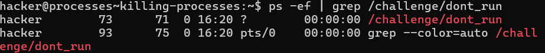
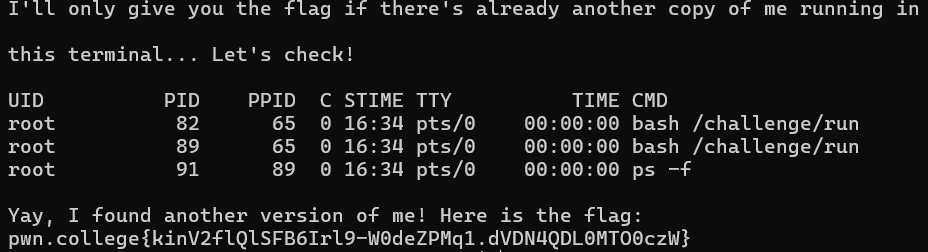

# Processes and Jobs
In modern computing, software is split into two categories: operating system kernels and processes.When Linux starts up, it launches an init (short for initializer) process that, in turn, launches a bunch of other processes which launch more processes until, eventually, you are looking at your command line shell, which is also a process!

this module is about learning to view and interact with processes in a number of ways
   

## Challenge-1 Listing Processes
In this challenge `/challenge/run` is renamed to something random and `ls` cannot be used in /challenge

The new /challenge/run process is already running so using `ps -ef` would show the new name of the process.
On running ps -ef the output is: 

    UID          PID    PPID  C STIME TTY          TIME CMD
    root           1       0  0 16:13 ?        00:00:00 /sbin/docker-init -- /nix/var/nix/profiles/default/bin/dojo-init /run/dojo/bin/sleep 6h
    root           7       1  0 16:13 ?        00:00:00 /run/dojo/bin/sleep 6h
    root          68       1  0 16:13 ?        00:00:00 /challenge/10730-run-24901
    root          72      68  0 16:13 ?        00:00:00 sleep 6h
    hacker        73       0  0 16:13 pts/0    00:00:00 /run/dojo/bin/ssh-entrypoint
    hacker        96      73  0 16:16 pts/0    00:00:00 ps -ef

On using the command `/challenge/10730-run-24901` the flag we get is

flag `pwn.college{U7P_2O9-Ber8ggGDML8Aw-rEQDT.dhzM4QDL0MTO0czW}`
  

## Challenge-2 Killing Processes
This challenge teaches us about killing previously running processes that might be hurting the current process
`/challenge/dont_run` must be killed before `/challenge/run` is executed so you get the flag.

The `PID` of `/challenge/dont_run` is found by using the `ps` command by: `ps -ef | grep /challenge/dont_run`

This gives the output:

The process is killed using `kill` by `kill 73`

Now running `/challenge/run` gives the flag
flag `pwn.college{M8LsAffQOikaNTnlxo_t4WzJMSn.dJDN4QDL0MTO0czW}`
  

## Challenge-3 Interrupting Processes
This challenge is about learning how to get rid of the process that's clogging up your terminal!

`/challenge/run` is run first and it gives the output:

    I could give you the flag... but I won't, until this process exits. Remember, you can force me to exit with Ctrl-C. Try it now!

After using the hotkey `Ctrl-C` it gives the flag

flag `pwn.college{kip6l0sz0JGd8r2R8lr3K8RtlID.dNDN4QDL0MTO0czW}`
  

## Challenge-4 Suspending Processes
The first instance of `/challenge/run` is run.

It is suspended using the hotkey `Ctrl-Z.`

Then after running the next instance of `/challenge/run`, the flag outputted is

flag `pwn.college{kinV2flQlSFB6Irl9-W0deZPMq1.dVDN4QDL0MTO0czW}`
  

## Challenge-5 Resuming Processes
Usually, when you suspend processes, you'll want to resume them at some point.
To do this we have a very handy `fg` command

Just like the previous challenge `/challenge/run` is run and then suspended using `Ctrl-Z`

Then it is resumed using `fg`
flag `pwn.college{MqFhixDD7lXSB8OOQF921Uo2OpB.dZDN4QDL0MTO0czW}`
  

## Challenge-6 Background Processes
Just like the previous challenge `/challenge/run` is run and then suspended using `Ctrl-Z`

Then it is resumed in the background using `bg`.

Another instance of `/challenge/run` giving us the flag
flag `pwn.college{g9lE9C93Y78axMkvM-PQxGgBOJu.ddDN4QDL0MTO0czW}`
  

## Challenge-7 Foreground Processes
Like previous challenges we start by using 
`/challenge/run`

Uh oh..... we have to reusme it in the background after suspending it. We `Ctrl-Z` to suspend and `bg` to run it in background.

    Now we use `fg` to run it in foreground. getting this
    /challenge/run
    YES! Great job! I'm now running in the foreground. Hit Enter for your flag!

    pwn.college{AqvI_HAr0YWzMqRfOAlc_QwYj_J.dhDN4QDL0MTO0czW}

flag `pwn.college{AqvI_HAr0YWzMqRfOAlc_QwYj_J.dhDN4QDL0MTO0czW}`
  

## Challenge-8 Starting Background Processes
`/challenge/run` needs to be backgrounded without suspending it first. This can be done by appending a `&` to the command:

`/challenge/run &` gives the flag:

flag `pwn.college{IegDNXI3_pPMiGgyCgT9nwsXYUp.dlDN4QDL0MTO0czW}`
  

## Challenge-9 Process Exit Codes
The exit-code of `/challenge/get-code` must be accessed and used as an argument for `/challenge/submit-code`.

After running `/challenge/get-code` the exit code is stored in the shell variable `?`

Therefore `echo $?` prints the exit code which is `36`

`/challenge/submit-code 36` gives the flag

flag `pwn.college{Q-oFGYZlcw0HA-EZ3e33EC-Cmdt.dljN4UDL0MTO0czW}`

